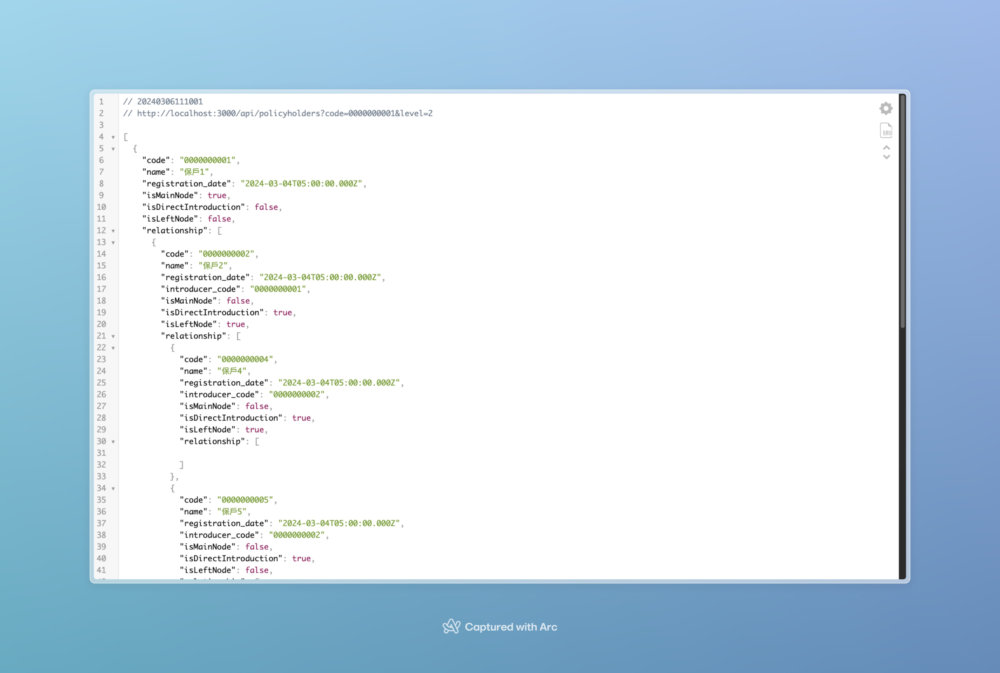
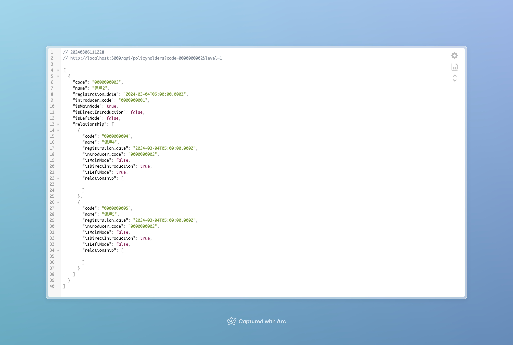
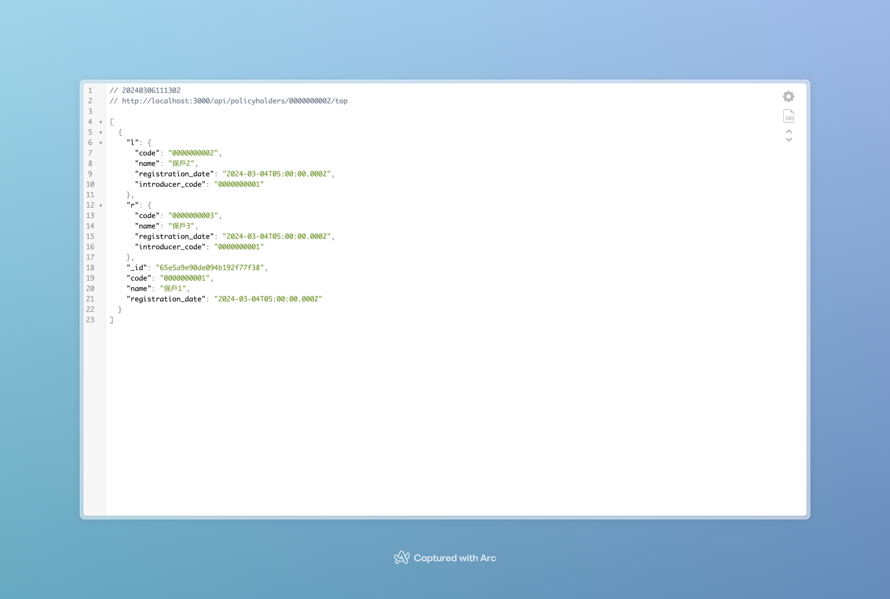

# 組織圖 (後端)

簡單使用 koa 建置兩支 API，方便demo，.env及其於結構沒有特別建立，直接啟用即可

## 安裝&啟用

```bash
git clone git@github.com:christechh/demo.git
cd demo
npm install
node app.js
```

## DB

資料庫 export .json 及 .csv 放置在專案根目錄

- demo.policyholder.csv
- demo.policyholder.json

---

## 範例

- http://localhost:3000/api/policyholders?code=0000000001&level=2


- http://localhost:3000/api/policyholders?code=0000000002&level=1


- http://localhost:3000/api/policyholders/0000000002/top


## 情境

目前您任職於一間軟體公司，有間保險業的客戶委託了一個「保戶介紹關係系統」。

## 規則說明

介紹關係的規則如下，

1. 保戶的介紹關係是以二元樹的組織方式呈現
2. 每個保戶可介紹的人數不限
3. 由保戶直接介紹的新保戶稱為「直接介紹保戶」
4. 由保戶直接介紹的新保戶再介紹的新保戶稱為「間接介紹保戶」
5. 每次產生介紹新保戶時，會產生在人數最少的節點下，當左右 2 邊人數相同時，會以左邊為優先
6. 每個保戶的基本資訊為「保戶編號」、「保戶姓名」、「加入(介紹)日期」、「介紹人保戶編號」

## 系統需求

### 客戶的需求

1. 以 Web 的方式呈現
2. 可以使用「保戶編號」搜尋保戶
3. 搜尋後以該保戶為「主節點」並呈現該保戶 4 階的介紹關係
4. 原搜尋的保戶「主節點」以不同顏色區別
5. 每個子節點以不同顏色區別「直接介紹」& 「間接介紹」客戶
6. 每個子節點點擊後，會以該結點為「主節點」再呈現 4 階的介紹關係

